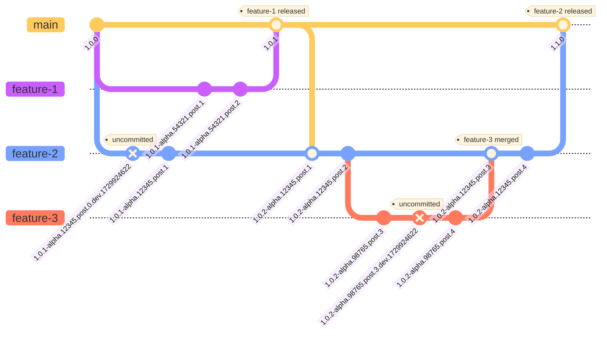
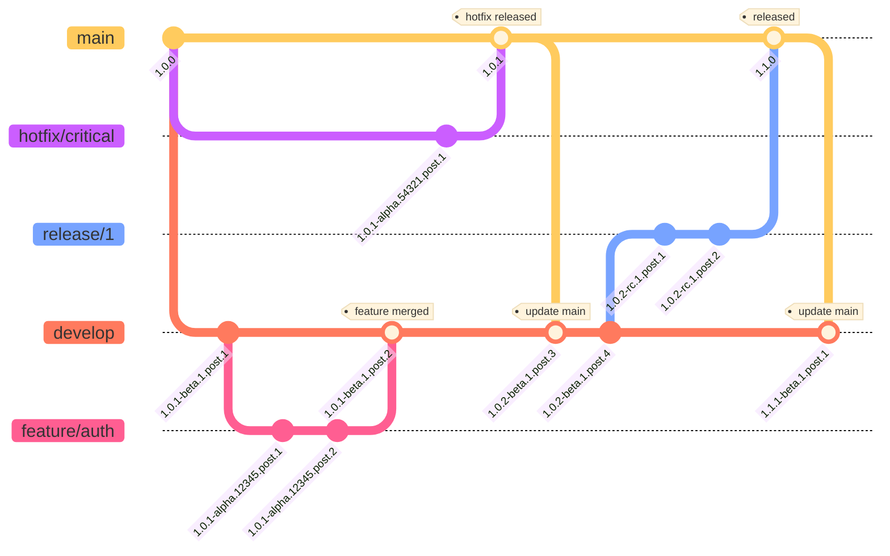

# Zerv Flow

This document defines the planned `zerv flow` subcommand, an opinionated automation layer that builds on Zerv's existing `zerv version` functionality. While `zerv version` provides flexible configuration options, `zerv flow` adds intelligent branching strategies and automated version progression that make complete semantic versioning effortless. `zerv flow` eliminates manual version management decisions across all semantic components (major.minor.patch, pre-releases, build metadata), transforming any Git state into meaningful versions across multiple formats for seamless CI/CD workflows.

## Architecture

**Zerv Flow**: Automates intelligent semantic versioning decisions for any Git state, enabling continuous CI/CD workflows without manual version management.

### Core Principles

1. **Semantic state capture** - Extract semantic meaning from ANY Git state (any branch, any commit, uncommitted changes)
2. **Multi-format output** - Transform semantic meaning into various version formats (SemVer, PEP440, Docker SemVer, etc.) with customizable format support for different ecosystems
3. **Seamless semantic release integration** - Work seamlessly with semantic release tools that manage major.minor.patch, while Zerv provides fully automated pre-release versioning with no-brainer intuitive bumping, enabling seamless CI/CD throughout the entire SDLC
4. **Build traceability** - Include sufficient context to trace versions back to exact Git states

### Version Format Explained

**Full Example**: `1.0.1-alpha.12345.post.3.dev.1729924622+feature.auth.1.f4a8b9c`

**Structure**: `<BASE>-<PRE_RELEASE>.<POST>[.<DEV>][+BUILD_CONTEXT]`

- **`1.0.1`** - Base version (patch bump from `v1.0.0`)
- **`alpha.12345`** - Pre-release type and branch identification (alpha + hash)
- **`post.1`** - Commit distance from branch point
- **[.dev.timestamp]** - Optional dev timestamp for dirty state
- **[+BUILD_CONTEXT]** - Optional build context for traceability
    - Format: `+branch.name[.distance].commit-hash`
    - Distance shown only when distance != post distance

**Key Point**: The core version `<BASE>-<PRE_RELEASE>.<POST>[.<DEV>]` contains all semantic meaning needed to understand Git state. The build context `[+BUILD_CONTEXT]` is optional and provides additional verbose information for easier interpretation and traceability.

**Version Variations**:

- **Tagged release**: `1.0.1`
- **Tagged pre-release**: `2.0.1-rc.1.post.2`
- **Branch from Tagged release**: `1.0.1-alpha.54321.post.1+feature.login.1.f4a8b9c`
- **Branch from Tagged pre-release**: `2.0.1-alpha.98765.post.3+fix.auth.bug.1.c9d8e7f`
- **Uncommitted changes**: `2.0.1-alpha.98765.post.4.dev.1729924622+fix.auth.bug.1.c9d8e7f`

### Pre-release Resolution Strategy

**Default behavior**: All branches start as `alpha.<hash-id>` (hash-based identification)

**Configurable branch patterns**: Users can configure specific branches to use custom pre-release types (alpha, beta, rc) with optional numbers:

- Example: `feature/user-auth` branch → `beta.12345` (label only, uses hash-based number)
- Example: `develop` branch → `beta.1` (label and custom number for stable branches)
- Any branch can be mapped to any pre-release type (alpha, beta, rc) with hash-based or custom numbers

**Branch name resolution**: Extract pre-release information from branch name patterns:

- Example: `release/1/feature-auth-fix` → `rc.1` (extracts number from branch pattern)
- Simplified GitFlow-inspired naming conventions

- **Note**: Branch names are conventions, not strict requirements - Zerv provides flexible pattern matching and user configuration.

**Clean branches**: `main`, `master` → No pre-release (clean releases)

**Post-release resolution when branching**:

- Reset to `.post.1` when pre-release label INCREASES (alpha → beta → rc)
- Continue post count when pre-release label STAYS SAME OR DECREASES (alpha → alpha, beta → beta, beta → alpha)
- Starting from clean release: Continue with `.post.1` (previous post count was 0)
- Examples:
    - `1.0.2-beta.1.post.56` → `1.0.2-rc.1.post.1` (beta→rc, reset)
    - `1.0.2-beta.1.post.57` → `1.0.2-alpha.12345.post.58` (beta→alpha, continue)
    - `1.0.2-alpha.12345.post.3` → `1.0.2-alpha.54321.post.4` (alpha→alpha, continue)
    - `1.0.2` → `1.0.2-alpha.98765.post.1` (clean→alpha, continue from post 0)

## Examples

This section demonstrates how Zerv Flow works across different branching strategies and Git scenarios.

**Note**: To keep diagrams clean and readable, build context is omitted from version strings in the examples. Dirty state (`.dev.timestamp`) is shown in diagrams when applicable.

**Example**: A commit appears as `1.0.1-alpha.12345.post.3.dev.1729924622` in the diagrams. With build context enabled: `1.0.1-alpha.12345.post.3.dev.1729924622+feature.user-auth.3.a1b2c3d`

### Trunk-Based Development

**Purpose**: Shows Zerv Flow handling a complex trunk-based workflow with parallel feature development, branch synchronization, and nested feature branches.

**Scenario Overview**:

- Development starts from `v1.0.0` on main
- Three feature branches created in parallel: `feature-1`, `feature-2`, and later `feature-3`
- `feature-1` gets completed and released first (`v1.0.1`)
- `feature-2` syncs with main to get `feature-1` changes, then continues development
- `feature-3` branches from `feature-2` to implement a sub-feature
- `feature-3` merges back to `feature-2`, which then releases as `v1.1.0`

**Key Zerv Flow behaviors demonstrated**:

- **Uncommitted changes**: Shows dirty state with `.dev.timestamp` suffix
- **Parallel development**: Different branches get unique hash-based IDs (`12345`, `54321`, `98765`)
- **Version progression**: Base version updates when syncing with main (`1.0.1` → `1.0.2`)
- **Post-release distance resets**: Counters reset to `.post.1` after syncing with new base version
- **Nested feature branches**: `feature-3` branching from `feature-2` with independent versioning
- **Merge handling**: Clean version progression through complex merge scenarios
- **Alpha pre-releases**: All development branches use `alpha` pre-release identifiers

### GitFlow Branching Strategy

**Purpose**: Shows Zerv Flow handling GitFlow methodology with proper pre-release type mapping and merge patterns.

**Scenario Overview**:

- Main branch has `v1.0.0` while develop branch has progressed to `1.0.1-beta.1.post.1`
- Feature branch `feature/auth` develops authentication functionality from develop
- Hotfix branch `hotfix/critical` addresses emergency issue from main production
- Release branch `release/1` prepares the next release from develop
- GitFlow merge patterns demonstrate proper version progression through the workflow

**Key Zerv Flow behaviors demonstrated**:

- **Beta pre-releases**: Develop branch uses `beta` identifier for integration builds
- **Alpha pre-releases**: Feature branches use `alpha` with hash-based identification
- **RC pre-releases**: Release branches use `rc` identifier for release candidates
- **Clean releases**: Main branch maintains clean versions without pre-release suffixes
- **Hotfix emergency flow**: Critical fixes from main with proper version propagation
- **Post-release resolution**: Correct post counting based on pre-release type changes
- **Base version propagation**: Version bumps when syncing branches with newer main releases

## Scope and Limitations

- **Scope**: Git state → semantic version mapping
- **Out of Scope**: Git operations (handled by Git) and version usage (Docker tags, package releases, CI/CD deployment)
- **Known Limitations**: Hash collisions possible by design. Users can use longer hash lengths or distributed sequence numbering for zero collisions (requires external coordination)
