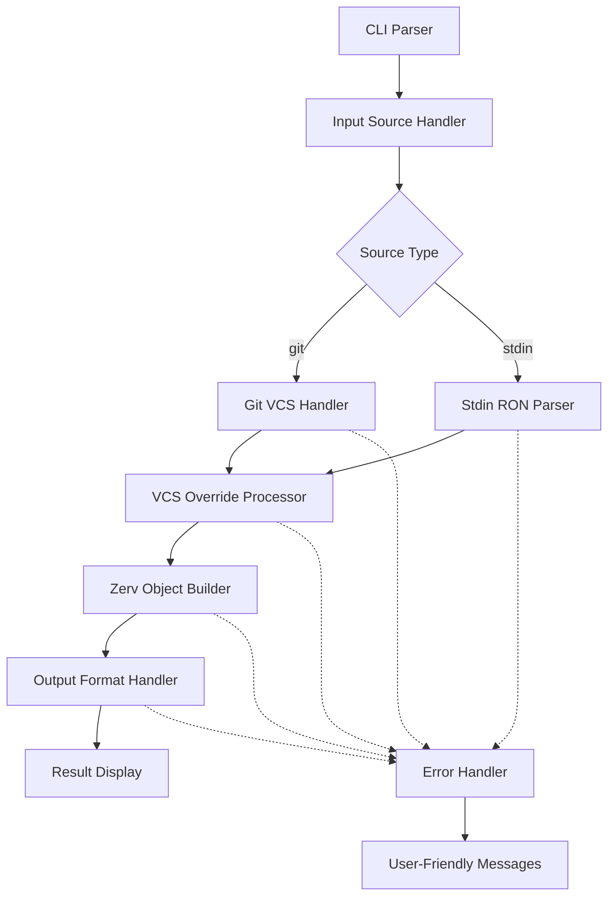

# Design Document

## Overview

This design document outlines the implementation approach for enhancing the Zerv version command to support comprehensive input sources, VCS overrides, enhanced error handling, and Zerv RON piping workflows. The design builds upon the existing architecture while adding significant new capabilities for advanced use cases.

## Architecture

### High-Level Flow

```
Input Sources → Validation/Format Check → Data Processing → Schema Application → Output Formatting
     ↓              ↓                      ↓                ↓                    ↓
  Git/Stdin → Parse Version Objects → Override Merge → Zerv Transform → PEP440/SemVer/RON
            (PEP440/SemVer from tags)
```

**Key Processing Points:**

- **Git Source**: Tag versions are parsed into PEP440 or SemVer objects during validation
- **Tag Override**: `--tag-version` values are parsed into appropriate version objects
- **Stdin Source**: Zerv RON is parsed and validated for structure
- **Override Merge**: VCS data is merged with CLI overrides
- **Zerv Transform**: All inputs are normalized to Zerv internal representation

### Component Interaction



## Version Object Parsing Strategy

During the validation/format check phase, version strings (from git tags or `--tag-version` overrides) are parsed into structured version objects:

1. **Auto-Detection**: Try SemVer parsing first, fall back to PEP440
2. **Validation**: Ensure version strings conform to format specifications
3. **Normalization**: Convert to internal representation for processing
4. **Error Handling**: Provide clear messages for invalid version formats

```rust
pub enum VersionObject {
    SemVer(SemVer),
    PEP440(PEP440),
}

impl VersionObject {
    pub fn parse_auto(version_str: &str) -> Result<Self> {
        // Try SemVer first
        if let Ok(semver) = SemVer::from_str(version_str) {
            return Ok(VersionObject::SemVer(semver));
        }

        // Fall back to PEP440
        if let Ok(pep440) = PEP440::from_str(version_str) {
            return Ok(VersionObject::PEP440(pep440));
        }

        Err(ZervError::InvalidVersion(format!(
            "Version '{}' is not valid SemVer or PEP440 format", version_str
        )))
    }
}
```

## Components and Interfaces

### 1. Enhanced CLI Parser

**Location:** `src/cli/version.rs`

**New Fields:**

```rust
#[derive(Parser)]
pub struct VersionArgs {
    // Existing fields
    pub version: Option<String>,
    pub source: String,
    pub schema: Option<String>,
    pub schema_ron: Option<String>,
    pub output_format: String,

    // Input format for version parsing (semver, pep440, zerv)
    #[arg(long, default_value = "semver")]
    pub input_format: String,

    // VCS override options
    #[arg(long)]
    pub tag_version: Option<String>,
    #[arg(long)]
    pub distance: Option<u32>,
    #[arg(long)]
    pub dirty: Option<FuzzyBool>,
    #[arg(long)]
    pub clean: bool,
    #[arg(long)]
    pub current_branch: Option<String>,
    #[arg(long)]
    pub commit_hash: Option<String>,

    // Output options
    #[arg(long)]
    pub output_template: Option<String>,
    #[arg(long)]
    pub output_prefix: Option<String>,
}
```

### 2. Fuzzy Boolean Parser

**Location:** `src/cli/utils/fuzzy_bool.rs` (new file)

```rust
#[derive(Debug, Clone, PartialEq)]
pub struct FuzzyBool(pub bool);

impl FromStr for FuzzyBool {
    type Err = String;

    fn from_str(s: &str) -> Result<Self, Self::Err> {
        match s.to_lowercase().as_str() {
            "true" | "t" | "yes" | "y" | "1" | "on" => Ok(FuzzyBool(true)),
            "false" | "f" | "no" | "n" | "0" | "off" => Ok(FuzzyBool(false)),
            _ => Err(format!("Invalid boolean value: '{}'. Supported values: true/false, t/f, yes/no, y/n, 1/0, on/off", s))
        }
    }
}
```

### 3. Input Source Handler

**Location:** `src/cli/utils/source_handler.rs` (new file)

```rust
pub enum InputSource {
    Git(GitVcsData),
    Stdin(ZervRonData),
}

pub struct InputSourceHandler;

impl InputSourceHandler {
    pub fn resolve_input_source(args: &VersionArgs, work_dir: &Path) -> Result<InputSource> {
        match args.source.as_str() {
            "git" => {
                let vcs_data = Self::get_git_data(work_dir)?;
                Ok(InputSource::Git(vcs_data))
            }
            "stdin" => {
                let ron_data = Self::read_stdin_ron()?;
                Ok(InputSource::Stdin(ron_data))
            }
            source => Err(ZervError::UnknownSource(source.to_string()))
        }
    }

    fn read_stdin_ron() -> Result<ZervRonData> {
        // Implementation for reading and validating Zerv RON from stdin
    }
}
```

### 4. VCS Override Processor

**Location:** `src/cli/utils/vcs_override.rs` (new file)

```rust
pub struct VcsOverrideProcessor;

impl VcsOverrideProcessor {
    pub fn apply_overrides(
        mut vcs_data: VcsData,
        args: &VersionArgs
    ) -> Result<VcsData> {
        // Validate conflicting options
        Self::validate_override_conflicts(args)?;

        // Apply individual overrides
        if let Some(tag) = &args.tag_version {
            vcs_data.tag_version = Some(tag.clone());
        }

        if let Some(distance) = args.distance {
            vcs_data.distance = distance;
        }

        if let Some(dirty) = &args.dirty {
            vcs_data.is_dirty = dirty.0;
        }

        if args.clean {
            vcs_data.distance = 0;
            vcs_data.is_dirty = false;
        }

        // Apply other overrides...

        Ok(vcs_data)
    }

    fn validate_override_conflicts(args: &VersionArgs) -> Result<()> {
        if args.clean && (args.distance.is_some() || args.dirty.is_some()) {
            return Err(ZervError::ConflictingOptions(
                "Cannot use --clean with --distance or --dirty (conflicting options)".to_string()
            ));
        }
        Ok(())
    }
}
```

### 5. Input Format Handler

**Location:** `src/cli/utils/format_handler.rs` (new file)

```rust
pub struct InputFormatHandler;

impl InputFormatHandler {
    pub fn parse_version_string(version_str: &str, input_format: &str) -> Result<VersionObject> {
        match input_format {
            "semver" => {
                SemVer::from_str(version_str)
                    .map(VersionObject::SemVer)
                    .map_err(|e| ZervError::InvalidFormat(
                        format!("Invalid SemVer format: {}", e)
                    ))
            }
            "pep440" => {
                PEP440::from_str(version_str)
                    .map(VersionObject::PEP440)
                    .map_err(|e| ZervError::InvalidFormat(
                        format!("Invalid PEP440 format: {}", e)
                    ))
            }
            "auto" => {
                // Auto-detection fallback
                VersionObject::parse_auto(version_str)
            }
            _ => Err(ZervError::UnknownFormat(input_format.to_string()))
        }
    }

    pub fn parse_stdin(input_format: &str) -> Result<ZervObject> {
        let mut input = String::new();
        std::io::stdin().read_to_string(&mut input)
            .map_err(|_| ZervError::StdinError("No input provided via stdin".to_string()))?;

        if input.trim().is_empty() {
            return Err(ZervError::StdinError("No input provided via stdin".to_string()));
        }

        match input_format {
            "zerv" => {
                // Parse as Zerv RON
                ron::from_str::<ZervObject>(&input)
                    .map_err(|e| ZervError::InvalidFormat(
                        format!("Invalid Zerv RON format: {}", e)
                    ))
            }
            "semver" | "pep440" => {
                // Error: stdin should be Zerv RON when using these formats
                Err(ZervError::StdinError(
                    format!("When using --source stdin with --input-format {}, stdin must contain Zerv RON format. Use --input-format zerv or provide version via --tag-version instead.", input_format)
                ))
            }
            _ => Err(ZervError::UnknownFormat(input_format.to_string()))
        }
    }
}

pub enum VersionObject {
    SemVer(SemVer),
    PEP440(PEP440),
}

impl VersionObject {
    // Auto-detection for backward compatibility
    pub fn parse_auto(version_str: &str) -> Result<Self> {
        if let Ok(semver) = SemVer::from_str(version_str) {
            return Ok(VersionObject::SemVer(semver));
        }

        if let Ok(pep440) = PEP440::from_str(version_str) {
            return Ok(VersionObject::PEP440(pep440));
        }

        Err(ZervError::InvalidVersion(format!(
            "Version '{}' is not valid SemVer or PEP440 format", version_str
        )))
    }
}
```

### 6. Enhanced Error Handler

**Location:** `src/error.rs` (enhanced)

**New Error Types:**

```rust
pub enum ZervError {
    // Existing variants...

    // New CLI-specific errors
    UnknownSource(String),
    ConflictingOptions(String),
    StdinError(String),
    BooleanParseError(String),

    // Enhanced VCS errors with source context
    VcsNotFoundWithSource { source: String, message: String },
    NoTagsFoundWithSource { source: String },
    CommandFailedWithContext { source: String, operation: String, message: String },
}
```

### 7. Pipeline Orchestrator

**Location:** `src/cli/version.rs` (enhanced)

```rust
pub fn run_version_pipeline(
    args: VersionArgs,
    directory: Option<&str>,
) -> Result<String> {
    // 1. Determine working directory
    let work_dir = resolve_work_directory(directory)?;

    // 2. Resolve input source and parse version data
    let mut zerv_object = match args.source.as_str() {
        "git" => {
            // Get git VCS data
            let vcs_data = detect_vcs(&work_dir)?.get_vcs_data()?;

            // Parse git tag with input format if available
            let mut processed_data = vcs_data;
            if let Some(tag) = &processed_data.tag_version {
                let version_obj = InputFormatHandler::parse_version_string(tag, &args.input_format)?;
                // Convert back to VCS data with parsed version
                processed_data = update_vcs_data_with_parsed_version(processed_data, version_obj)?;
            }

            // Apply overrides (including --tag-version with input format)
            let final_vcs_data = VcsOverrideProcessor::apply_overrides(processed_data, &args)?;

            // Convert to Zerv object
            vcs_data_to_zerv_object(final_vcs_data)?
        }
        "stdin" => {
            // Parse stdin as Zerv RON (input_format must be "zerv")
            let mut zerv_from_stdin = InputFormatHandler::parse_stdin(&args.input_format)?;

            // Apply overrides to the parsed Zerv object (like --tag-version)
            if args.has_overrides() {
                zerv_from_stdin = VcsOverrideProcessor::apply_overrides_to_zerv(zerv_from_stdin, &args)?;
            }

            zerv_from_stdin
        }
        source => return Err(ZervError::UnknownSource(source.to_string()))
    };

    // 3. Apply schema if specified
    if args.schema.is_some() || args.schema_ron.is_some() {
        zerv_object = apply_schema_to_zerv(zerv_object, args.schema.as_deref(), args.schema_ron.as_deref())?;
    }

    // 4. Apply output formatting
    let output = OutputFormatter::format_output(&zerv_object, &args)?;

    Ok(output)
}
```

## Data Models

### VcsData Structure (Unchanged)

The existing `VcsData` structure remains unchanged as it properly represents version control metadata without implementation details:

```rust
#[derive(Debug, Clone, PartialEq)]
pub struct VcsData {
    pub tag_version: Option<String>,
    pub distance: u32,
    pub commit_hash: String,
    pub commit_hash_short: String,
    pub current_branch: Option<String>,
    pub commit_timestamp: i64,
    pub tag_timestamp: Option<i64>,
    pub is_dirty: bool,
}
```

**Design Principle**: `VcsData` contains only version control metadata, not process or source information.

### Zerv RON Data Structure

```rust
#[derive(Debug, Clone, PartialEq, Serialize, Deserialize)]
pub struct ZervRonData {
    pub schema: ZervSchema,
    pub vars: ZervVars,
}

impl ZervRonData {
    pub fn to_vcs_data(&self) -> Result<VcsData> {
        // Convert Zerv RON back to VcsData for processing
    }

    pub fn validate(&self) -> Result<()> {
        // Validate that required fields are present
    }
}
```

## Error Handling

### Error Message Strategy

1. **Source-Aware Messages**: All VCS-related errors include the specific source
2. **Actionable Guidance**: Errors provide clear next steps
3. **Context Preservation**: Include relevant context (file paths, command args)
4. **Consistent Formatting**: Standardized error message patterns

### Error Translation Patterns

```rust
impl GitVcs {
    pub fn translate_git_error(&self, stderr: &[u8]) -> ZervError {
        let stderr_str = String::from_utf8_lossy(stderr);

        if stderr_str.contains("fatal: ambiguous argument 'HEAD'") {
            return ZervError::CommandFailedWithContext {
                source: "git".to_string(),
                operation: "get commits".to_string(),
                message: "No commits found in git repository".to_string(),
            };
        }

        if stderr_str.contains("not a git repository") {
            return ZervError::VcsNotFoundWithSource {
                source: "git".to_string(),
                message: "Not in a git repository (--source git)".to_string(),
            };
        }

        // Additional patterns...
    }
}
```

### Stdin Validation Strategy

1. **Format Detection**: Distinguish between RON and simple strings
2. **RON Validation**: Parse and validate Zerv RON structure
3. **Helpful Suggestions**: Guide users to correct usage patterns
4. **Detailed Parsing Errors**: Include line/column information for RON errors

## Testing Strategy

### Unit Tests

1. **CLI Parser Tests**: Validate all new argument combinations
2. **Boolean Parser Tests**: Test all supported boolean formats
3. **Override Logic Tests**: Validate conflict detection and application
4. **Stdin Parser Tests**: Test RON parsing and error cases
5. **Error Translation Tests**: Verify all error message patterns

### Integration Tests

1. **End-to-End Workflows**: Test complete piping scenarios
2. **Git Integration**: Test with various repository states
3. **Error Scenarios**: Test all error conditions with real git repos
4. **Performance Tests**: Validate response time requirements

### Test Data Strategy

```rust
// Test fixtures for various scenarios
pub struct VersionCommandTestFixtures;

impl VersionCommandTestFixtures {
    pub fn create_tagged_repo() -> GitRepoFixture { /* ... */ }
    pub fn create_dirty_repo() -> GitRepoFixture { /* ... */ }
    pub fn create_distance_repo(distance: u32) -> GitRepoFixture { /* ... */ }
    pub fn sample_zerv_ron() -> String { /* ... */ }
    pub fn invalid_ron_samples() -> Vec<String> { /* ... */ }
}
```

## Implementation Phases

### Phase 1: Core Infrastructure

- Fuzzy boolean parser
- VCS override processor
- Enhanced error types
- Basic stdin support

### Phase 2: Stdin RON Support

- RON parser implementation
- Input validation
- Format detection
- Error message enhancement

### Phase 3: Advanced Features

- Output formatting options
- Template support
- Performance optimization
- Comprehensive testing

### Phase 4: Integration & Polish

- End-to-end testing
- Documentation updates
- Error message refinement
- Performance validation

## Security Considerations

1. **Input Validation**: Strict validation of all user inputs
2. **Command Injection**: Safe handling of git commands and arguments
3. **Path Traversal**: Secure directory operations
4. **Resource Limits**: Prevent excessive memory usage with large inputs

## Performance Considerations

1. **Git Command Optimization**: Minimize git command executions
2. **RON Parsing**: Efficient parsing of large RON inputs
3. **Memory Management**: Avoid unnecessary data copying
4. **Caching**: Cache git repository metadata when appropriate

## Backward Compatibility

1. **Existing CLI**: All current command patterns continue to work
2. **Output Formats**: Existing output remains unchanged
3. **Error Codes**: Maintain existing exit code behavior
4. **Configuration**: Existing schema and configuration files work unchanged

## Future Extensions

1. **Additional Sources**: Support for other VCS systems (hg, svn)
2. **Custom Templates**: Advanced output template system
3. **Configuration Files**: Support for .zervrc configuration
4. **Plugin System**: Extensible architecture for custom processors
