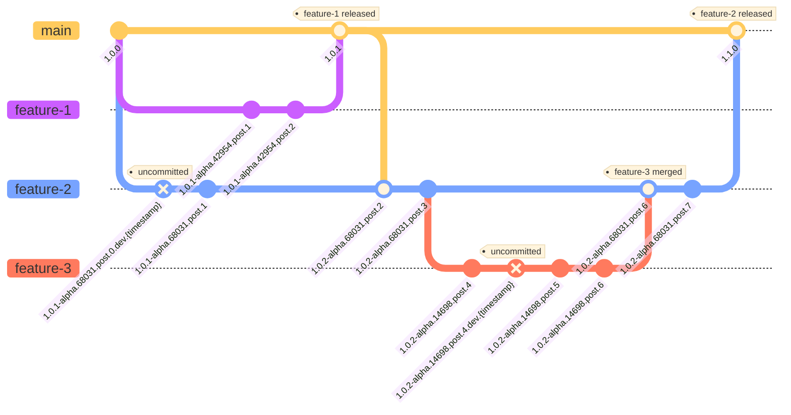
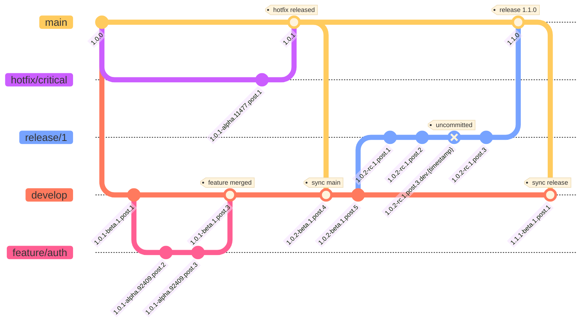

[](https://github.com/wislertt/zerv/actions/workflows/ci-test.yml)
[](https://github.com/wislertt/zerv/actions/workflows/cd.yml)
[](https://sonarcloud.io/summary/new_code?id=wislertt_zerv)
[](https://sonarcloud.io/summary/new_code?id=wislertt_zerv)
[](https://sonarcloud.io/summary/new_code?id=wislertt_zerv)
[](https://codecov.io/gh/wislertt/zerv)
[](https://crates.io/crates/zerv)
[](https://crates.io/crates/zerv)

# zerv

**Automatic versioning for every commit** - Generate semantic versions from any commit across all branches, or dirty working directory, with seamless pre-release handling and flexible format support for any CI/CD workflow.

## Quick Start

```bash
# Install
cargo install zerv

# Try automated versioning (current branch determines output)
zerv flow
# → 1.0.0 (on main branch with tag v1.0.0)
# → 1.0.1-rc.1.post.3 (on release branch with pre-release tag)
# → 1.0.1-beta.1.post.3+develop.3.gf297dd0 (on develop branch)
# → 1.0.1-alpha.59394.post.1+feature.new.auth.1.g4e9af24 (on feature branch)
# → 1.0.1-alpha.17015.post.1.dev.1764382150+feature.dirty.work.1.g54c499a (on dirty feature branch)
```

<!-- Corresponding test: tests/integration_tests/flow/docs/quick_start.rs:test_quick_start_documentation_examples -->

## Key Features

- **zerv version**: Flexible, configurable version generation with full control
- **zerv flow**: Opinionated, automated pre-release management based on Git branches
- **Smart Schema System**: Auto-detects clean releases, pre-releases, and build context
- **Multiple Formats**: SemVer, PEP440 (Python), CalVer, custom schemas
- **CI/CD Integration**: Complements semantic release with branch-based pre-releases and full override control

## Usage Examples

### zerv flow: Automated branch-based versions

**Purpose**: Intelligent pre-release management that automatically generates meaningful versions from any Git state without manual decisions.

#### Core Principles

1. **Semantic state capture** - Extract semantic meaning from ANY Git state (any branch, any commit, uncommitted changes)
2. **Multi-format output** - Transform semantic meaning into various version formats with customizable format support
3. **Seamless semantic release integration** - Work with semantic release tools while providing fully automated pre-release versioning
4. **Build traceability** - Include sufficient context to trace versions back to exact Git states

#### Version Format Explained

**Full Example**: `1.0.1-alpha.12345.post.3.dev.1729924622+feature.auth.1.f4a8b9c`

**Structure**: `<BASE>-<PRE_RELEASE>.<POST>[.<DEV>][+BUILD_CONTEXT]`

- **`1.0.1`** - Base version (semantic meaning from tags)
- **`alpha.12345`** - Pre-release type and branch identification
- **`post.3`** - Commits since reference point
- **`[.dev.timestamp]`** - Optional dev timestamp for uncommitted changes
- **`[+BUILD_CONTEXT]`** - Optional build context for traceability

**Key Point**: The core version `<BASE>-<PRE_RELEASE>.<POST>[.<DEV>]` contains all semantic meaning needed to understand Git state. The build context `[+BUILD_CONTEXT]` is optional and provides additional verbose information for easier interpretation and traceability.

**Version Variations**:

- **Tagged release**: `1.0.1`
- **Tagged pre-release**: `2.0.1-rc.1.post.2`
- **Branch from Tagged release**: `1.0.1-alpha.54321.post.1+feature.login.1.f4a8b9c`
- **Branch from Tagged pre-release**: `2.0.1-alpha.98765.post.3+fix.auth.bug.1.c9d8e7f`
- **Uncommitted changes**: `2.0.1-alpha.98765.post.4.dev.1729924622+fix.auth.bug.1.c9d8e7f`

#### Pre-release Resolution Strategy

**Default behavior**: All branches start as `alpha.<hash-id>` (hash-based identification)

**Configurable branch patterns**: Users can configure specific branches to use custom pre-release types (alpha, beta, rc) with optional numbers:

- Example: `feature/user-auth` branch → `beta.12345` (label only, uses hash-based number)
- Example: `develop` branch → `beta.1` (label and custom number for stable branches)
- Any branch can be mapped to any pre-release type (alpha, beta, rc) with hash-based or custom numbers

**Branch name resolution**: Extract pre-release information from branch name patterns:

- Example: `release/1/feature-auth-fix` → `rc.1` (extracts number from branch pattern)
- Simplified GitFlow-inspired naming conventions

- **Note**: Branch names are conventions, not strict requirements - Zerv provides flexible pattern matching and user configuration.

**Clean branches**: `main`, `master` → No pre-release (clean releases)

**Post-release resolution logic**:

- **Configurable post representation** with two options:
    - **Tag Distance**: Count commits from last tag
    - **Commit Distance**: Count commits from branch creation point
- **Default**: Tag Distance (most common use case)
- **`post.0`**: Exactly on reference point (no commits since)
- **`post.N`**: N commits since reference point
- **Consistent across all branch types** (alpha, beta, rc, etc.)

**Examples**:

**Tag Distance (release branches):**

```
main: v1.0.0 (tag)
└── release/1 (created) → create tag v1.0.1-rc.1.post.1
    └── 1 commit → 1.0.1-rc.1.post.1.dev.1729924622  (same post, dev timestamp)
    └── 2 commits → 1.0.1-rc.1.post.1.dev.1729924623  (same post, dev timestamp)
    └── create tag → 1.0.1-rc.1.post.2  (new tag increments post)
    └── more commits → 1.0.1-rc.1.post.2.dev.1729924624  (new post, dev timestamp)
```

**Commit Distance (develop branch):**

```
main: v1.0.0 (tag)
└── develop (created from v1.0.0) → commit 1.0.1-beta.1.post.1  (1 commits since branch creation)
    └── 5 commits later → 1.0.1-beta.1.post.6  (6 commits since branch creation)
    └── 1 more commit → 1.0.1-beta.1.post.7  (7 commits since branch creation)
```

#### Workflow Examples

This section demonstrates how Zerv Flow works across different branching strategies and Git scenarios.

**Note**: To keep diagrams clean and readable, build context is omitted from version strings in the examples. Dirty state (`.dev.timestamp`) is shown in diagrams when applicable.

**Example**: A commit appears as `1.0.1-alpha.12345.post.3.dev.1729924622` in the diagrams. With build context enabled: `1.0.1-alpha.12345.post.3.dev.1729924622+feature.user-auth.3.a1b2c3d`

##### Trunk-Based Development

**Purpose**: Complex trunk-based workflow with parallel features, nested branches, and synchronization scenarios.

**Scenario**: Development from `v1.0.0` with parallel feature branches, synchronization, and nested development.



**Key behaviors demonstrated**:

- **Parallel development**: `feature-1` and `feature-2` get unique hash IDs (`42954`, `68031`)
- **Version progression**: Base version updates when syncing (`1.0.1` → `1.0.2`)
- **Dirty state**: Uncommitted changes show `.dev.timestamp` suffix
- **Nested branches**: `feature-3` branches from `feature-2` with independent versioning
- **Clean releases**: Main branch maintains semantic versions on merges

<!-- Corresponding test: tests/integration_tests/flow/scenarios/trunk_based.rs:test_trunk_based_development -->

##### GitFlow Branching Strategy

**Purpose**: GitFlow methodology with proper pre-release type mapping and merge patterns.

**Scenario**: Main branch with `v1.0.0`, develop branch integration, feature development, hotfix emergency flow, and release preparation.



**Key behaviors demonstrated**:

- **Beta pre-releases**: Develop branch uses `beta` for integration builds
- **Alpha pre-releases**: Feature branches use `alpha` with hash-based identification
- **RC pre-releases**: Release branches use `rc` for release candidates
- **Clean releases**: Main branch maintains clean versions without pre-release suffixes
- **Hotfix flow**: Emergency fixes from main with proper version propagation
- **Branch synchronization**: Develop branch syncs with main releases

<!-- Corresponding test: tests/integration_tests/flow/scenarios/gitflow.rs:test_gitflow_development_flow -->
