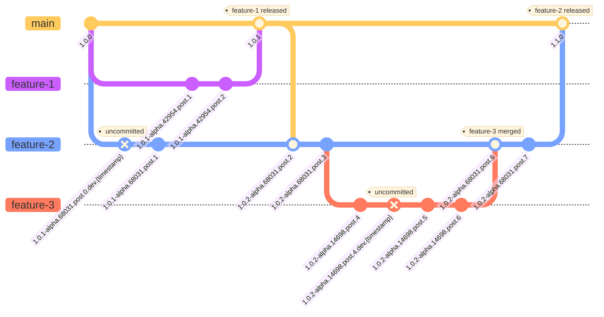
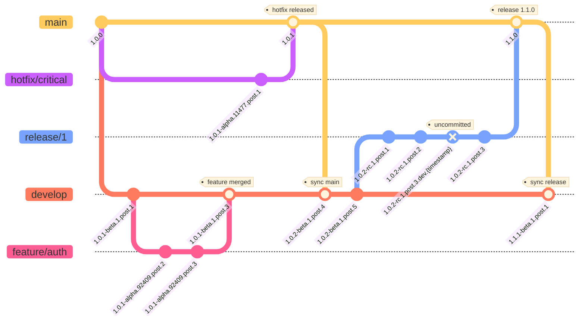
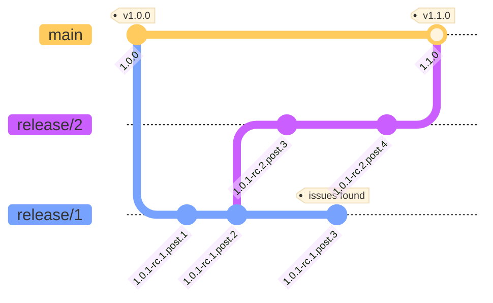

`zerv flow` is automated pre-release management: it generates meaningful versions from any
Git state without manual decisions. The [version command](/concepts/version) gives you raw
control; flow layers opinionated, branch-driven logic on top of it.

## Core principles

1. **Semantic state capture** - Extract semantic meaning from ANY Git state (any branch, any
   commit, uncommitted changes)
2. **Multi-format output** - Transform semantic meaning into various version formats with
   customizable format support
3. **semantic-release integration** - Work with semantic release tools while providing
   fully automated pre-release versioning
4. **Build traceability** - Include sufficient context to trace versions back to exact Git
   states

## Version format

**Full example**: `1.0.1-alpha.12345.post.3.dev.1729924622+feature.auth.1.f4a8b9c`

**Structure**: `<BASE>-<PRE_RELEASE>.<POST>[.<DEV>][+BUILD_CONTEXT]`

- **`1.0.1`** - Base version (semantic meaning from tags)
- **`alpha.12345`** - Pre-release type and branch identification
- **`post.3`** - Commits since reference point
- **`[.dev.timestamp]`** - Optional dev timestamp for uncommitted changes
- **`[+BUILD_CONTEXT]`** - Optional build context for traceability

**Key point**: The core version `<BASE>-<PRE_RELEASE>.<POST>[.<DEV>]` contains all semantic
meaning needed to understand Git state. The build context `[+BUILD_CONTEXT]` is optional and
provides additional verbose information for easier interpretation and traceability.

**Version variations**:

- **Tagged release**: `1.0.1`
- **Tagged pre-release**: `2.0.1-rc.1.post.2`
- **Branch from tagged release**: `1.0.1-alpha.54321.post.1+feature.login.1.f4a8b9c`
- **Branch from tagged pre-release**: `2.0.1-alpha.98765.post.3+fix.auth.bug.1.c9d8e7f`
- **Uncommitted changes**: `2.0.1-alpha.98765.post.4.dev.1729924622+fix.auth.bug.1.c9d8e7f`

## Pre-release resolution

**Default behavior**: all branches start as `alpha.<hash-id>` (hash-based identification).

**Configurable branch patterns**: map specific branches to custom pre-release types (alpha,
beta, rc) with optional numbers:

- Example: `feature/user-auth` branch → `beta.12345` (label only, uses hash-based number)
- Example: `develop` branch → `beta.1` (label and custom number for stable branches)
- Any branch can be mapped to any pre-release type with hash-based or custom numbers

**Branch name resolution**: extract pre-release information from branch name patterns:

- Example: `release/1/feature-auth-fix` → `rc.1` (extracts number from branch pattern)
- Simplified GitFlow-inspired naming conventions

**Note**: Branch names are conventions, not strict requirements. zerv provides flexible
pattern matching and user configuration. See the
[branch rules on the flow CLI page](/cli/flow#branch-rules).

**Clean branches**: `main`, `master` → no pre-release (clean releases).

## Post-release resolution

**Configurable post representation** with two options:

- **Tag distance** *(default)*: count commits from the last tag
- **Commit distance**: count commits from the branch creation point
- **`post.0`**: exactly on reference point (no commits since)
- **`post.N`**: N commits since reference point
- Consistent across all branch types (alpha, beta, rc, etc.)

**Tag distance (release branches):**

```
main: v1.0.0 (tag)
└── release/1 (created) → create tag v1.0.1-rc.1.post.1
    └── 1 commit → 1.0.1-rc.1.post.1.dev.1729924622  (same post, dev timestamp)
    └── 2 commits → 1.0.1-rc.1.post.1.dev.1729924623  (same post, dev timestamp)
    └── create tag → 1.0.1-rc.1.post.2  (new tag increments post)
    └── more commits → 1.0.1-rc.1.post.2.dev.1729924624  (new post, dev timestamp)
```

**Commit distance (develop branch):**

```
main: v1.0.0 (tag)
└── develop (created from v1.0.0) → commit 1.0.1-beta.1.post.1  (1 commits since branch creation)
    └── 5 commits later → 1.0.1-beta.1.post.6  (6 commits since branch creation)
    └── 1 more commit → 1.0.1-beta.1.post.7  (7 commits since branch creation)
```

## Workflow examples

These diagrams show how flow behaves across branching strategies. To keep them readable,
build context is omitted from version strings; dirty state (`.dev.timestamp`) is shown where
relevant.

A commit shown as `1.0.1-alpha.12345.post.3.dev.1729924622` here reads
`1.0.1-alpha.12345.post.3.dev.1729924622+feature.user-auth.3.a1b2c3d` with build context
enabled.

### Trunk-based development

Complex trunk-based workflow with parallel features, nested branches, and synchronization.

**Scenario**: development from `v1.0.0` with parallel feature branches, synchronization, and
nested development.



**Key behaviors demonstrated**:

- **Parallel development**: `feature-1` and `feature-2` get unique hash IDs (`42954`, `68031`)
- **Version progression**: base version updates when syncing (`1.0.1` → `1.0.2`)
- **Dirty state**: uncommitted changes show `.dev.timestamp` suffix
- **Nested branches**: `feature-3` branches from `feature-2` with independent versioning
- **Clean releases**: main branch maintains semantic versions on merges

{/* Corresponding test: tests/integration_tests/flow/scenarios/trunk_based.rs:test_trunk_based_development_flow */}

### GitFlow

GitFlow methodology with proper pre-release type mapping and merge patterns.

**Scenario**: main branch with `v1.0.0`, develop branch integration, feature development,
hotfix emergency flow, and release preparation.



**Key behaviors demonstrated**:

- **Beta pre-releases**: develop branch uses `beta` for integration builds
- **Alpha pre-releases**: feature branches use `alpha` with hash-based identification
- **RC pre-releases**: release branches use `rc` for release candidates
- **Clean releases**: main branch maintains clean versions without pre-release suffixes
- **Hotfix flow**: emergency fixes from main with proper version propagation
- **Branch synchronization**: develop branch syncs with main releases

{/* Corresponding test: tests/integration_tests/flow/scenarios/gitflow.rs:test_gitflow_development_flow */}

### Complex release management

Release branch scenarios including branch abandonment and cascading release preparation.

**Scenario**: main branch with `v1.0.0`, release branch preparation with critical issues
leading to abandonment, and selective branch creation for successful release.



**Version progression details**:

- **release/1**: `1.0.1-rc.1.post.1` → `1.0.1-rc.1.post.2` → `1.0.1-rc.1.post.3` (abandoned)
- **release/2**: created from `release/1`'s second commit (`1.0.1-rc.1.post.2`), continues as
  `1.0.1-rc.2.post.3` → `1.0.1-rc.2.post.4`
- **Main**: clean progression `1.0.0` → `1.1.0` (only from the successful `release/2` merge)

**Key behaviors demonstrated**:

- **Branch isolation**: each release branch maintains independent versioning regardless of
  parent/child relationships
- **Selective branching**: flow correctly handles branches created from specific historical
  commits
- **Abandonment handling**: unmerged branches don't affect final release versions on main
- **Cascade management**: complex branching scenarios where releases feed into other releases
  are handled transparently
- **Clean main branch**: main only receives versions from successfully merged releases,
  maintaining clean semantic versioning

{/* Corresponding test: tests/integration_tests/flow/scenarios/complex_release_branch.rs:test_complex_release_branch_abandonment */}

## Where to go next

- [Flow CLI](/cli/flow) - schema presets, `--branch-rules`, and override flags
- [Schema system](/concepts/schema-system) - what `core`, `extra_core`, and `build` mean
- [Why zerv](/getting-started/why-zerv) - how flow differs from release automation
